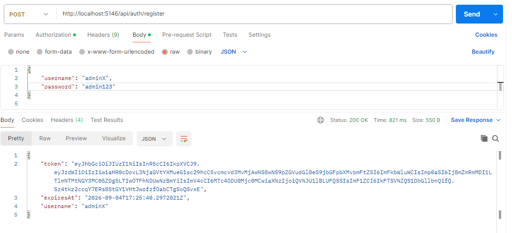
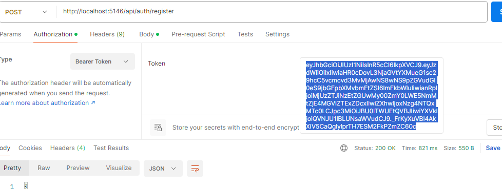
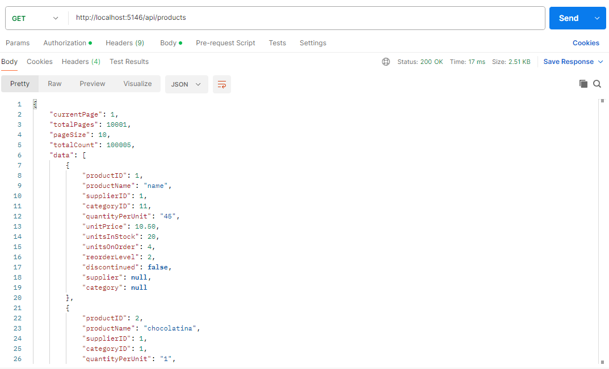
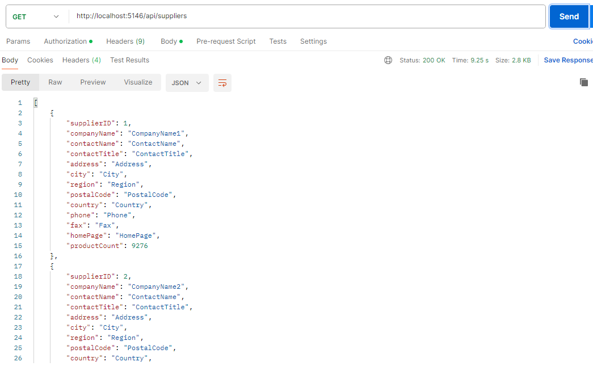
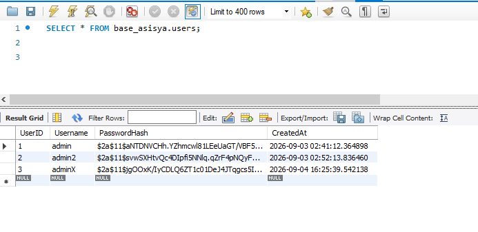

# Pruebas Backend   .NET 8

Se presentan las imagenes sobre el funcionamiento del proyecto Backend netCore 8

## Punto de enrtada - Postman

Se require realizar un registro de usuario si no esta en la base de datos

Se utiliza este texto json para registro y login.

    { 
        "username": "admin", 
        "password": "admin123" 
    }

A continuación se observa cuando se registra un usuario se genera un Token JWT que debe agragarse a la "Authorization" de postman y agragar en "bearer token" para acceder a las consultas. Los endpoint estan protegidos.

Se observa la consulta a "Productos". Se tiene un CRUD sobre esta entidad.

Se observa la consulta a "Categorias". Se tiene un CRUD sobre esta entidad.

Se observa la consulta a "Supplierss". Se tiene un CRUD sobre esta entidad.

# Seguridad token JWT   

Se observa que el usuario y la contraseña se guardan en la base de datos.
La contraseña esta encriptada.

