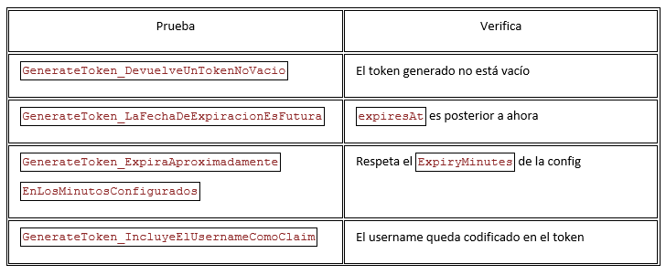
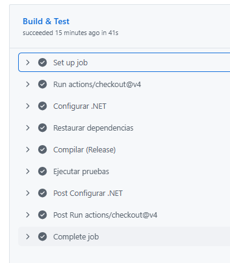
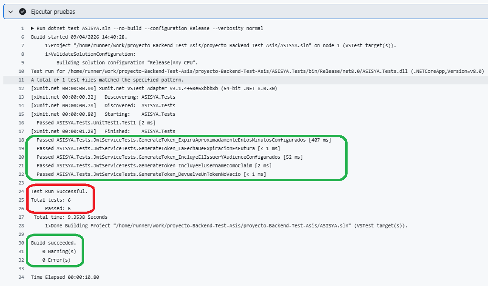

# Pruebas Backend   .NET 8

Construyo un proyecto de pruebas con xUnit, empezando por algo que no depende de base de datos ni HTTP — el servicio que genera el JWT (JwtService), perfecto para una primera prueba real:

Se crearón 5 pruebas sobre JwtService, sin tocar base de datos ni HTTP — todas usan una configuración JWT en memoria:

Se tiene un archivo "backend-ci.yml" con las instrucciones para ejecutar varios pasos automáticamente al realizar el push:
- configuración
- validar dependencias
- compilación
- pruebas

Pruebas Lint (exitosas)

## Detalle de pruebas componentes.

Se observa la ejecución exitosa de las preubas sobre el componente del backend.

Se realizan pruebas sobre el componente que genera el Token JWT.

Pruebas Lint (exitosas)

